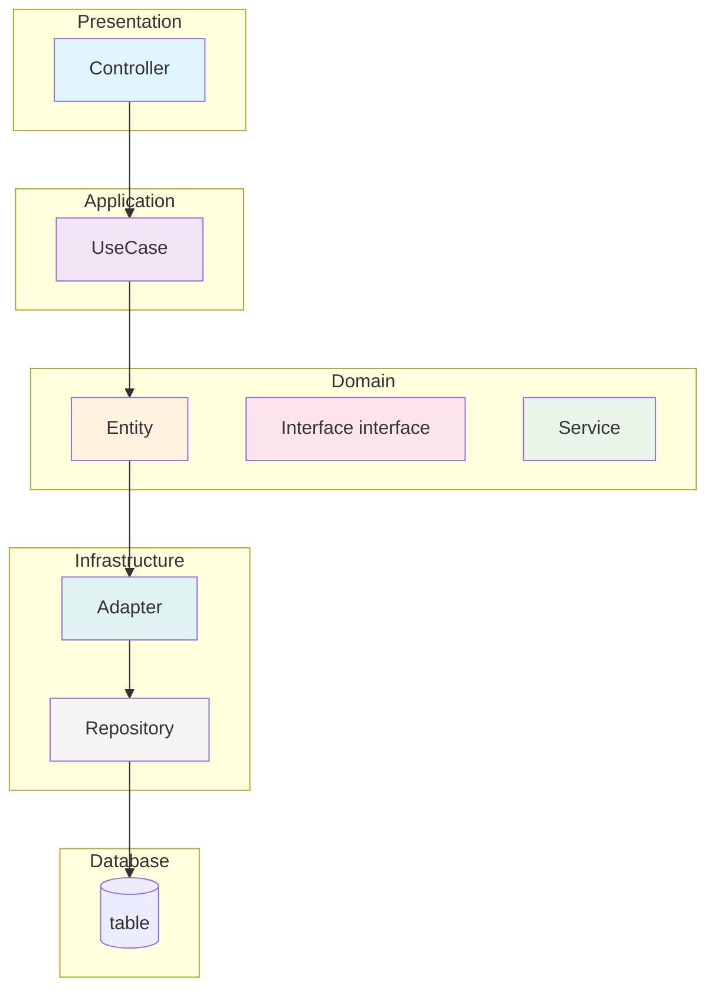
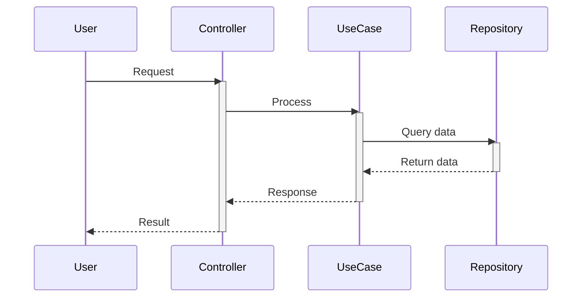

# Documentation Instructions

## Guardrails
- Always use markdown language for documentation, with clear formatting and structure.
- When generating diagrams, always use mermaid diagrams.
- We use Diataxis framework for documentation structure. Ensure to categorize content appropriately into tutorials, how-to guides, reference, and explanation sections.

## The Problem
Poor documentation leads to:
- Developer frustration and lost productivity
- Project abandonment in favor of alternatives
- Time wasted debugging and seeking help

## The Eight Rules of Good Documentation

### 1. **Inviting and Clear**
- Write in the clearest terms possible
- Don't skip steps or assume prior knowledge
- Avoid statements like "every X developer knows Y"
- Err on the side of verbosity over ambiguity

### 2. **Comprehensive**
- Document all aspects of the project
- Include all features and exceptions
- Eliminate guesswork by covering edge cases
- Remove ambiguity through complete coverage

### 3. **Skimmable**
- Use clear headings and structure
- Implement bulleted lists
- Add internal links for navigation
- Include table of contents for large projects

### 4. **Example-Driven**
- Provide examples of common use cases
- Show practical implementation
- Let comprehensive docs detail all possibilities while examples focus on typical usage

### 5. **Accepts Repetition (ARID)**
- Repeat information when it adds clarity
- Acknowledge users may not read everything linearly
- Balance DRY principles with clear communication
- Include "some moisture" to make docs effective

### 6. **Up-to-Date**
- Add documentation to "definition of done" in agile teams
- Treat documentation as a critical final step
- Update docs alongside code changes
- Maintain documentation during rapid iteration

### 7. **Easy to Contribute To**
- Store documentation as text in source control
- Treat docs like code
- Automate documentation builds
- Apply software development practices to documentation

### 8. **Easy to Find**
- Maintain an updated README file
- Link to extensive documentation from the README
- Ensure discoverability is straightforward

## Verification Steps
1. Can a new developer get started without help?
2. Are all features documented?
3. Can users quickly find what they need?
4. Are there practical examples?
5. Is critical information available where needed?
6. Does documentation reflect current code state?
7. Can others easily update the docs?
8. Is the documentation immediately discoverable?

## Mermaid Diagram Instructions

## Quick Reference
- **Syntax**: Use Mermaid for all diagrams in markdown files.
- **Preferred Type**: `graph TD` for layer dependencies.
- **Grouping**: Subgraphs by architectural layers (Presentation, Application, Domain, Infrastructure, Database).
- **Styling**: Mandatory color coding with predefined classes.

## Layer Architecture Diagrams

### Structure Rules
- Subgraphs: `Presentation`, `Application`, `Domain`, `Infrastructure`, `Database`.
- Arrows: `--> ` for dependencies.
- Nodes: Descriptive names, e.g., `PayrollActivitySetupController`.

### Labeling Rules
- Interfaces: Append "interface" (e.g., `PayrollActivityRepository interface`).
- Existing Components: No special markers.

### Color Coding (Mandatory)
Define classes after graph, assign to nodes.

```mermaid
classDef controller fill:#e1f5fe  // Light blue - REST controllers
classDef usecase fill:#f3e5f5    // Light purple - Application use cases
classDef entity fill:#fff3e0     // Light orange - Domain entities/value objects
classDef interface fill:#fce4ec  // Light pink - Domain interfaces
classDef service fill:#e8f5e8    // Light green - Domain services
classDef adapter fill:#e0f2f1    // Light cyan - Infrastructure adapters
classDef repository fill:#f5f5f5 // Light gray - JPA repositories
```

Assignments:
- Controllers: `class A controller`
- Use Cases: `class B usecase`
- Entities: `class C1,C2,C3 entity`
- Etc.

### Example Template


## Sequence Diagrams

### Structure Rules
- Start with `sequenceDiagram`.
- Define participants: `participant Name` (e.g., `participant UI`, `participant Controller`).
- Use arrows for messages: `A->>B: Message` (solid for sync, dashed for async if needed).
- Show activations: `activate A` / `deactivate A` for method calls.

### Labeling Rules
- Participants: Use layer or component names (e.g., `UI`, `Controller`, `UseCase`).
- Messages: Describe actions (e.g., `POST /api`, `validate request`).
- Notes: Use `Note over A,B: explanation` for clarifications.

### Example Template


## Other Diagrams
- `classDiagram`: Domain models.
- `erDiagram`: DB schemas.
- Ensure diagrams are syntactically correct and render properly.

## Validation
- Include in ADRs as specified.
- Consistent colors/styles.
- Test rendering.

**Remember:** Documentation serves both other developers and your future self.