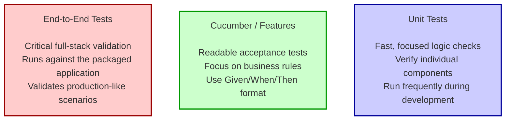

# Testing Overview

## Purpose

- **Why**: Explain why the project uses multiple, separated test suites and the rationale behind the
  test pyramid ordering.
- **Audience**: AI agents or developers who need to choose the right test layer and follow
  repository conventions.

## Test Types



### Priority Ordering

1. **Cucumber/Features**: Provides readable behavior specifications (Given/When/Then) for domain
   rules and acceptance criteria. They are fast because everything except domain and application
   layers is mocked
2. **Unit Tests**: Fast, focused checks for business logic and infrastructure adapters; the bulk of
   developer feedback during coding.
3. **End-to-End (e2e)**: Validates the full, running application and covers critical happy-path
   flows that must work in production.

## High-Level Goals

- **Cover all business scenarios with Cucumber**: Cucumber tests in this application are built to
  balance speed and user-readability. So all features must be covered by Cucumber tests.
- **Clear Acceptance Criteria**: Use feature files and Cucumber for business-readable scenarios.
- **Reliable Production Validation**: Run e2e tests against a built application to catch integration
  issues.
- **Reuse Fixtures and Mocks**: Avoid brittle, slow tests.

## Test Types, Locations, and Intent

| **Test Type**            | **Purpose**                                                               | **Typical Location**                            | **Runner**                             | **Gradle Task** |
|--------------------------|---------------------------------------------------------------------------|-------------------------------------------------|----------------------------------------|-----------------|
| **End-to-End (e2e)**     | Exercise the packaged application over HTTP and validate full-stack flows | `src/test/java/.../e2e`                         | `@QuarkusIntegrationTest`, RestAssured | `testE2e`       |
| **Unit / Quarkus Tests** | Fast verification of classes, domain logic, and infra adapters            | `src/test/java/.../infra_driven`                | JUnit 5 / `@QuarkusTest`               | `test`          |
| **Cucumber / Features**  | Business-readable scenarios in Gherkin (integration or e2e style)         | `src/test/resources/features/` + `.../cucumber` | CucumberQuarkusTest + TestProfile      | `testCucumber`  |

> **Note**: For details on runners, mocks, and assertions, see
> the [How-to: Running Tests guide](../how-to/RunningTests.md).

## Fixtures and Test Data

### Object Mothers

- **Pattern**: Reusable, domain-meaningful fixture builders live under `.../object_mother/` (
  examples: `UserMother`, `JwtMother`).
- **Guideline**: Keep them small, composable, and readable — prefer explicit builders over opaque
  factories.

## Mocks and Test Doubles

### Quarkus Alternatives

- **Usage**: Cucumber/integration-style tests use Quarkus `@Alternative` implementations for
  external dependencies (e.g., `UserRepositoryMock`, `JwtServiceMock`).
- **Test Profile**: These mocks are enabled by the Cucumber/Quarkus test profile (via
  `getEnabledAlternatives()`), which keeps the tests lightweight by disabling DB migration/ORM and
  other heavy subsystems.

## JSON Response Matching and Assertions

- **JSONAssert**: Use JSONAssert (org.skyscreamer:jsonassert) in LENIENT mode for HTTP response body
  checks when partial matching suffices. This reduces brittleness from extra or unordered fields.
- **AssertJ**: Use AssertJ for unit/component assertions.
- **RestAssured/Hamcrest**: Use these for fluent HTTP-level assertions in e2e tests.

## Gradle Tasks and Common Run Commands

### Unit/Component Tests

```bash
./gradlew test
```

### Cucumber Feature Suites

```bash
# Run all cucumber features
./gradlew testCucumber

# Run a specific feature or scenario
./gradlew testCucumber -PfeatureFile=src/test/resources/features/auth/integration.feature
./gradlew testCucumber -PscenarioName="1. Successful login"
```

### End-to-End Tests

```bash
# Build the app (quarkusBuild) then run e2e tests
./gradlew testE2e

# Filter e2e by feature or scenario
./gradlew testE2e -PfeatureFile=src/test/resources/features/auth/e2e.feature
./gradlew testE2e -PscenarioName="1. Successful login"
```