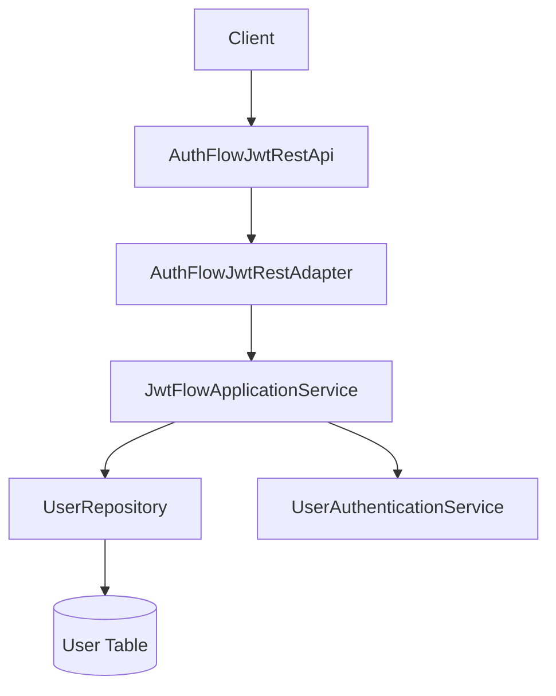
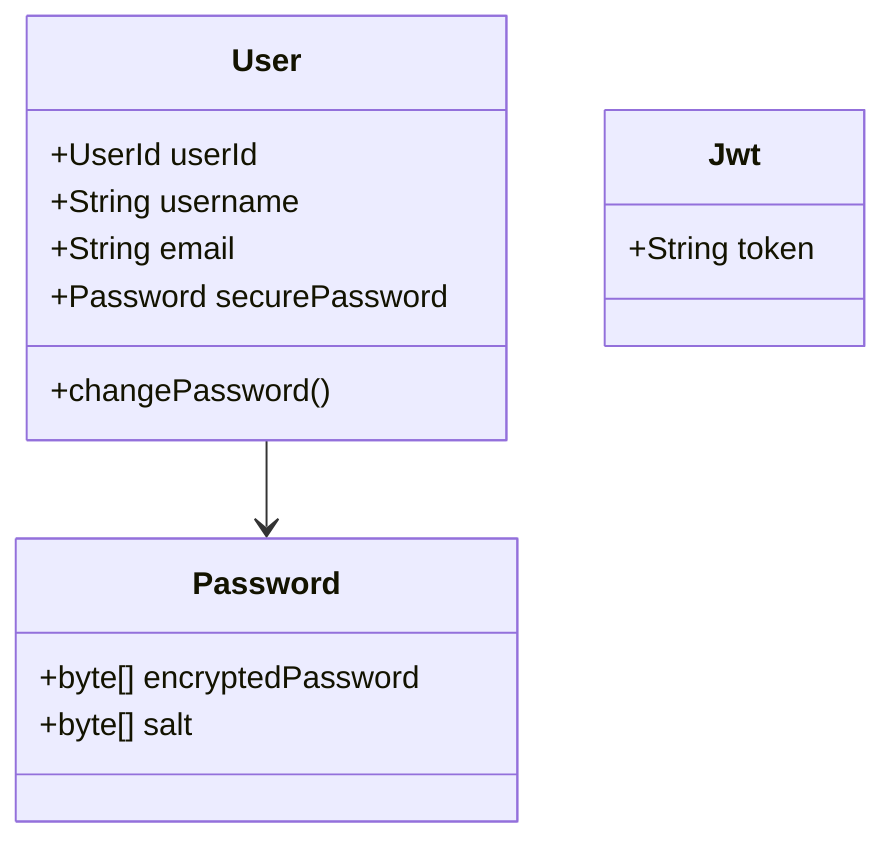
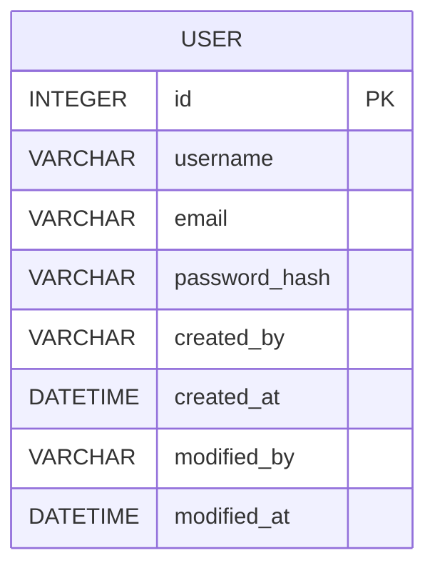
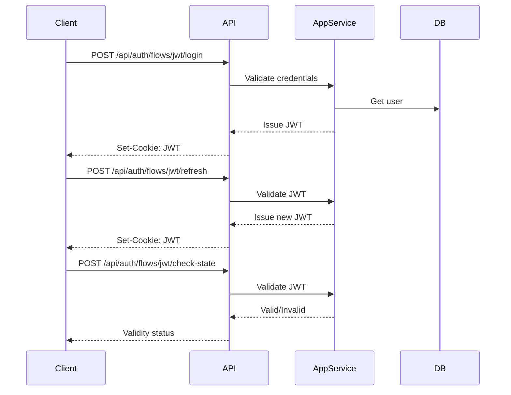

# ADR 2025-11-10: Kwik Hub Login Flow

## 1. Title and Metadata

- **Story Link:** https://www.notion.so/bagnascojhoel/Back-kwik-hub-login-flow-20cb4ca7bcb5801b98c2f086fa62adcd?source=copy_link
- **Title:** Back: kwik-hub login flow
- **Date:** 2025-11-10
- **Status:** Draft

## 2. Context

- **Business Problem:** Enable secure, maintainable authentication for Kwik-Hub with robust login, short-lived JWT tokens, refresh capability, and admin user initialization.
- **Constraints:**
  - Admin user (`kwik-admin`) created via migration; password set by env var or generated securely
  - JWT tokens expire after 15 minutes
  - Stateless authentication (no server-side session store)
  - Distributed session support
  - Secure cookies (`HttpOnly`, `SameSite=Strict`, `Secure`)
- **Existing Architecture:**
  - Quarkus, Hibernate ORM, Liquibase, BCrypt, JWT, REST API, OpenAPI
  - Follows layered architecture: Infra_Driving, Application, Domain, Infra_Driven

## 3. Decision

- **What:** Implement stateless JWT authentication with login, refresh, and check-state endpoints. Use secure cookies and short-lived tokens. Admin onboarding on startup.
- **Why:** Matches existing codebase, supports distributed sessions, easy to maintain and extend.
- **How:**
  - REST endpoints: `/api/auth/flows/jwt/login`, `/api/auth/flows/jwt/refresh`, `/api/auth/flows/jwt/check-state`
  - Application service: `JwtFlowApplicationService` (add/verify refresh & check-state logic)
  - Domain: `User`, `Password`, `Jwt`, `UserAuthenticationService`
  - DB: `user` table, admin migration

## 4. Architectural Design

### 4.1 Layer Architecture

### 4.2 Domain Model Changes

### 4.3 Database Schema Changes

### 4.4 API Changes

- **POST /api/auth/flows/jwt/login**
  - Request: `{ "user": "...", "password": "..." }`
  - Response: JWT in cookie, HTTP 200
- **POST /api/auth/flows/jwt/refresh**
  - Request: JWT in cookie or header
  - Response: New JWT in cookie, HTTP 200
- **POST /api/auth/flows/jwt/check-state**
  - Request: JWT in cookie or header
  - Response: Validity status, HTTP 200
  - Headers: `Cache-Control: no-store, no-cache, must-revalidate`

### 4.5 External API Integrations

- None required for this flow

### 4.6 Flow Diagrams

## 5. Consequences

### 5.1 Positive

- Stateless, scalable authentication
- Easy distributed session support
- Secure password and token handling

### 5.2 Negative

- No JWT revocation (unless expiry is short)
- Replay risk if token is stolen

### 5.3 Neutral

- No external integrations

### 5.4 Risks & Mitigations

- Use short token expiry
- Secure cookie flags
- Synchronize clocks across nodes

## 6. References

- System patterns: `.ai/memory-bank/systemPatterns.md`
- Product context: `.ai/memory-bank/productContext.md`
- Progress: `.ai/memory-bank/progress.md`
- Migration scripts: `src/main/resources/migrations/auth/1-create-user-table.sql`, `2-add-kwik-user.sql`
- API: `AuthFlowJwtRestApi`, `JwtFlowApplicationService`
- Domain: `User`, `Password`, `Jwt`

